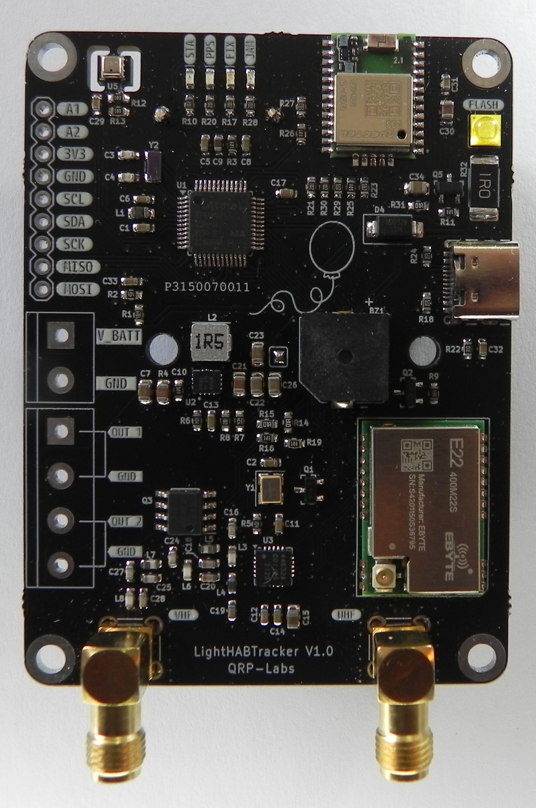
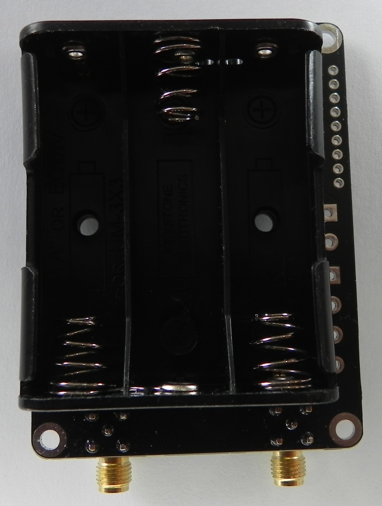
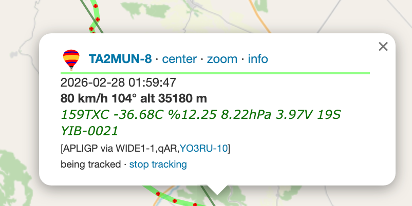
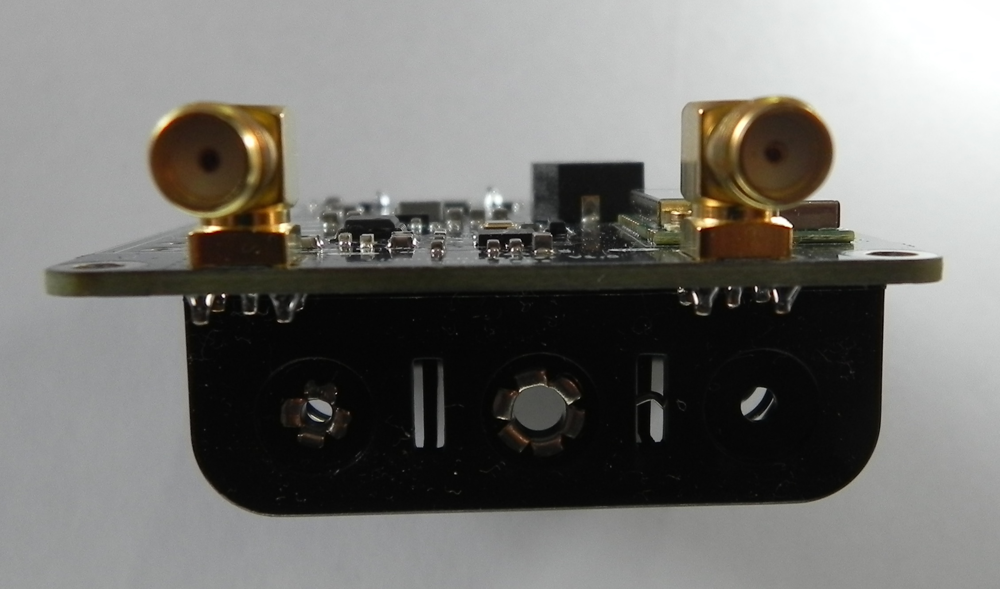

# LightHABTracker

LightHABTracker is one of the most affordable, smallest, lightest, powerful and open source dual-band APRS trackers available, purpose-built for High Altitude Balloon (HAB) flights. It makes tracking weather balloons, model rockets, RC aircraft, and anything else that flies simple and easy.

Unlike single-radio trackers, LightHABTracker carries **two radio modules** so it can beacon on **two bands**: **LoRa APRS (UHF)** via an SX1268 radio module and **AFSK APRS (VHF)** via an Si4463 radio module. The two radios transmit one at a time, each on its own configurable schedule. It reports location, altitude, temperature, humidity and pressure to the internet via LoRa APRS iGates / [APRS-IS](http://status.aprs2.net) or direct to another amateur radio, powered by a solar panel/super capacitors or batteries.

Because LightHABTracker is open source you can add your own custom sensors via I2C pins.

LightHABTracker will be available on https://shop.qrp-labs.com/ for order soon.

**Note :** Antennas and batteries are **not included** in the package. The board provides SMA Female antenna connectors and a 3 x AA battery holder, so you can attach your own antennas and batteries (Energizer Ultimate Lithium recommended).

**Important :** LightHABTracker uses the amateur 2 meter (VHF) and 70 cm / 433 MHz (UHF) radio bands. An amateur radio license is required to operate AFSK APRS on VHF, and may be required for LoRa on 433 MHz if it is not an ISM band in your country. Check your local regulations before using it.

If you need other trackers, check out the rest of the family:

**LightAPRS 2.0 (AFSK):** https://github.com/lightaprs/LightAPRS-2.0

**LightTracker 1.1 433MHz (LoRa):** https://github.com/lightaprs/LightTracker-1.1-433

Also if you need an iGate or Digipeater, check out:

**LightAPRS Gateway (AFSK) 1.0:** https://github.com/lightaprs/LightAPRSGateway-1.0/

**LightGateway (LoRa) 1.0:** https://github.com/lightaprs/LightGateway-1.0

<!-- TODO: add pinout diagram, e.g.  -->

## Features

- **Dual-band transmission** : LoRa APRS (UHF) and AFSK APRS (VHF) beacons from two onboard radios, each independently configurable and enable/disable-able. The radios transmit one at a time, each on its own schedule.
- **Automatic flight phase detection** : Detects READY TO LAUNCH, ASCENDING, DESCENDING and LANDED phases using short/long moving averages of altitude, and adjusts beacon intervals for flight vs. ground automatically.
- **Landing prediction** : Predicts and beacons the landing location during descent.
- **Cutdown / pyro control** : Two pyro channels with a remotely triggered, secret-protected cutdown command received over LoRa.
- **Onboard environmental sensor** : BME280 reports temperature, humidity and barometric pressure; barometric altitude is used as a fallback when there is no GPS fix.
- **Recovery aids** : Buzzer and flash LED that activate after landing (with day/night and altitude awareness to save battery).
- **Power management** : Battery voltage monitoring with low-power mode and GPS standby to extend life after landing.
- **High-altitude GPS** : GPS configured for high-altitude balloon mode so it keeps reporting above the standard altitude limit. (up to 80 km)

## Basic Features

- **Software** : Open Source
- **Weight** : 36 grams (without batteries & antennas)
- **Dimensions** : 56 mm x 75 mm
- **IDE** : Arduino
- **Platform** : ARM Cortex-M0+ (Arduino M0)
- **MCU** : ATSAMD21G18
- **Flash** : 256 kB
- **Ram** : 32 kB
- **Operating Frequency** : 48 MHz
- **Operating Voltage** : 3.3 Volt
- **Input Voltage** : 2.7 (min) - 16 Volt via USB or VBat pin
- **Sensor** : BME280 (pressure, temperature and humidity)
- **LoRa Radio Module (UHF)** : [EBYTE E22-400M22S](https://www.cdebyte.com/products/E22-400M22S) (SX1268)
- **LoRa Operating Frequency** : 410~493 MHz (configurable by code)
- **LoRa Max Power** : 22 dBm (configurable by code)
- **VHF Radio Module (AFSK)** : Si4463
- **VHF Operating Frequency** : 144-146 MHz (configurable by code)
- **VHF Low Pass Filter** : Available (7 elements)
- **VHF Max Radio Power** : 20 dBm
- **Antenna Connectors** : SMA Female (Antennas not included)
- **GPS** : [Quectel L96](https://www.quectel.com/product/gnss-l96/)
- **Cutdown / Pyro** : 2 channels
- **Other** : Buzzer, Status LED, Flash LED, Battery voltage monitoring
- **Battery Holder** : 3 x AA (Batteries not included)
- **Extended Pins** : I2C, Analog

## Configuration

To programme LightHABTracker, all you need is a USB (Type-C) cable, a few installations and configurations.

### 1.Install Arduino IDE

Download and install [Arduino IDE](https://www.arduino.cc/en/Main/Software). If you have already installed Arduino, please check for updates. Its version should be at least v1.8.13 or newer.

### 2.Configure Board

- Open the **Tools > Board > Boards Manager...** menu item.
- Type "Arduino SAMD" in the search bar until you see the **Arduino SAMD Boards (32-Bits Arm Cortex-M0+)** entry and click on it.

**IMPORTANT:** Do not use the latest version. Choose version **1.8.12**. If you choose later versions, you may get a "**bin/avrdude: bad CPU type in executable**" error.

- Click **Install** .
- After installation is complete, close the **Boards Manager** window.
- Open the **Tools > Board** menu item and select **Arduino SAMD Boards (32-Bits Arm Cortex-M0+) -> Arduino M0** from the list.

### 3.Copy Libraries & Compile Source Code

You are almost ready to programme LightHABTracker :)

- First download the repository to your computer using the green "[Code -> Download ZIP](https://github.com/lightaprs/LightHABTracker-1.0/archive/refs/heads/main.zip)" button and extract it.
- Open the flight sketch in the "[hab-tracking-lora-afsk-aprs](hab-tracking-lora-afsk-aprs)" folder. This is the main HAB flight firmware.
- You will notice some folders in the "libraries" folder. You have to copy these folders (libraries) into your Arduino libraries folder on your computer. Path to your Arduino libraries:

  **Windows** : This PC\Documents\Arduino\libraries\

  **Mac** : /Users/\<username\>/Documents/Arduino/libraries/

  The included libraries are: `ZeroAPRS`, `ZeroSi4463`, `RadioLib`, `TinyGPSPlus`, `SparkFun_BME280`, `Arduino-MemoryFree` and `LightHABLib`.

**IMPORTANT :** LightHABTracker uses additional libraries compared to other Light* trackers. Even if you copied libraries for another board before, copy these again. Otherwise you will get a compile error.

- Then open the `hab-tracking-lora-afsk-aprs.ino` file with Arduino IDE and change your settings:
  - Set your **callsign** and **SSID** in `afskConfig` (VHF) and `loraConfig` (UHF).
  - Enable/disable each radio with the `enabled` flag, and set frequencies, intervals, comment and status message.
  - (Optional) Configure cutdown in `cutDownConfig` (set `enabled` and a `secret`).
- Click **Verify** (If you get compile errors, check the steps above).

### 4.Upload

- First attach the proper antennas to your tracker. The radio modules may be damaged if operated without an antenna, since the power has nowhere to go.
- Connect LightHABTracker to your computer with a USB (Type-C) cable, then you should see a COM port under the **Tools->Port** menu item. Select that port.
- Click **Upload**
- Your tracker is ready to launch :)

## Support

If you have any questions or need support, please contact support@lightaprs.com

## Wiki

### General

* **[F.A.Q.](https://github.com/lightaprs/LightHABTracker-1.0/wiki/F.A.Q.)**

### Features

* **[Cutdown & Pyro Outputs](https://github.com/lightaprs/LightHABTracker-1.0/wiki/Cutdown-&-Pyro-Outputs)**
* **[Landing Prediction](https://github.com/lightaprs/LightHABTracker-1.0/wiki/Landing-Prediction)**
